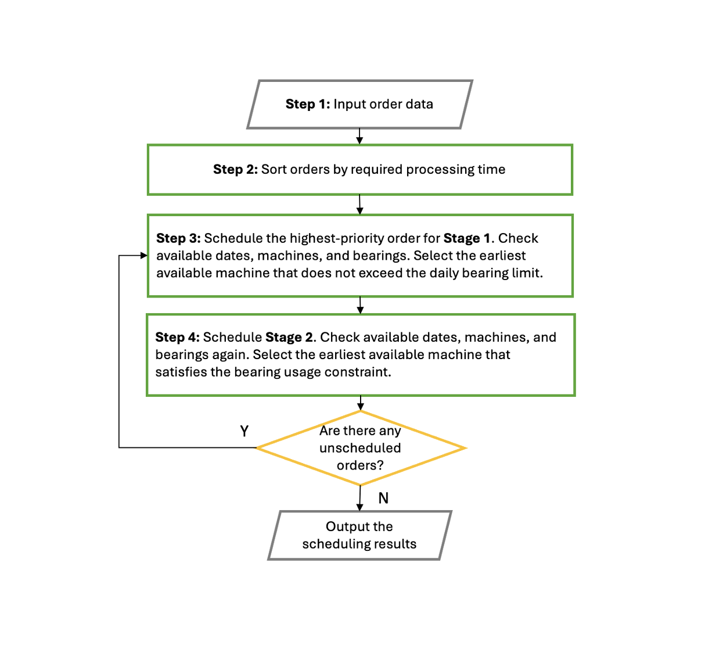
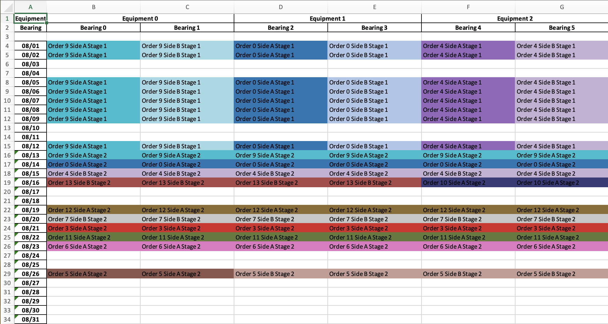

# Parallel Machine Scheduling with Dispatching Rules and Gurobi Model

This repository implements a **parallel machine scheduling problem** using two approaches:

1. **Heuristic / Dispatching Rule Simulation**: a Python-based scheduler that simulates equipment allocation under capacity and holiday constraints.  
2. **Gurobi Optimization Model**: an exact MILP formulation to find the optimal schedule.

The objective is to minimize **order tardiness** while accounting for:
- Multiple production lines and equipment types  
- Weekends and Taiwan national holidays  
- Two-stage order processing (Stage 1 = fixed time, Stage 2 = quantity-dependent)  
- Parallel production with limited machine capacity  

---

## Features

- **Calendar & Holidays**
  - Automatically detects weekends and Taiwan public holidays  
  - Maps valid working days and skips non-working days  

- **Equipment Allocation**
  - Each equipment (`E`) contains multiple bearings (`P`)  
  - Ensures no overlap in time or capacity  

- **Order Production Time (Two-Stage Process)**
  - **Stage 1:** Fixed-time processing  
  - **Stage 2:** Quantity-dependent processing  

- **Heuristic Scheduling**
  - Employs a priority queue (heapq) to determine dispatch order
  - Follows the Largest Processing Time (LPT) rule, giving precedence to orders with higher quantities

- **Excel Visualization**
  - Exports results to Excel (`xlsxwriter`)  
  - Each cell shows assigned *Order / Side / Stage*  
  - Color-coded by order for easy visualization  

---

## Project Structure
```
main/
├── data/
│   └── order/
│       └── {order_num}/
│           ├── quantity.txt
│           ├── value.txt
|           ├── order_num.txt
│           └── due_date.txt
├── Scheduling.ipynb # Gurobi optimization formulation
├── Dispatching_Rule.ipynb # Heuristic scheduling algorithm
├── results/
│   └── result/{order_num}/
|       ├── scheduling_gurobi_order_{order_num}.xlsx
│       └── scheduling_algorithm_order_{order_num}.xlsx
└── README.md
```


---


## Dispatching Rule Flowchart



---

## Gurobi Optimization Model 

### Objective function: 
Minimize the total penalty cost for late deliveries:

$$   
\min \sum_{k \in K} v_k * r * c_k
$$
    
where
- $v_k:$ revenue of order $k$,
- $r:$ penalty rate per delayed week,
- $c_k:$ number of delayed weeks for order $k$.

The objective minimizes the total cost incurred from overdue orders.


### Constraints

1.	**Stage 1 start limit:** each shaft can start at most one Stage 1 task per day.
2.	**Machine capacity:** each shaft can process only one order (Stage 1 or Stage 2) per day.
3.	**Assignment:** each order side starts its Stage 1 process on exactly one shaft.
4.	**Stage 1 duration:** once started, Stage 1 continues for a consecutive days.
5.	**Activation:** processing occurs only if a valid start time exists.
6.	**Stage precedence:** Stage 2 begins only after Stage 1 finishes.
7.	**Demand satisfaction:** Stage 2 workload must meet the required quantity $⌈ qₖ / b ⌉$.
8.	**Daily shaft limit:** at most 50 shaft groups (100 shafts) may operate per day.
9.	**Lateness (days):** compute delay as completion date – due date.
10. **Week lateness conversion:** convert lateness days into week units.
11. **Order lateness aggregation:** overall delay $c_k ≥$ delay of any side $w_{ki}$.
	
### Variable

| Variable | Type | Description |
|-----------|-----------|-----------|
| $x_{p0}^{lki}, x_{p1}^{lki}$  | Binary | Whether order k, side i starts Stage 1 / Stage 2 on shaft p at day l. |
| $y_{p0}^{lki}, y_{p1}^{lki}$  | Binary | hether order k, side i is being processed on shaft p at day l. |
| $t_{ki}$     | Continuous | Delivery delay in days for order k, side i. |
| $w_{ki}$    | Integer | Delivery delay in weeks for order k, side i. |
| $c_k$    | Integer | Overall delivery delay in weeks for order k.|


**Full model formulation:** see the detailed [Mathematical Model](./documents/Parallel_Machine_Scheduling.pdf).

---

## How to Run 

Create and activate a virtual environment
```bash
# Create a virtual environment
python -m venv venv

# Activate it
# On macOS / Linux
source venv/bin/activate

# On Windows (PowerShell)
venv\Scripts\activate
```

Install dependencies
```bash
pip install --upgrade pip
pip install -r requirements.txt
```

Run the notebooks separately
```bash
# Launch Jupyter Notebook
jupyter notebook
```

Then open and run each notebook:
- Dispatching_Rule.ipynb:  heuristic scheduling / dispatching logic
- Scheudling.ipynb:  mathematical optimization model using Gurobi

---

## Excel Output Example

